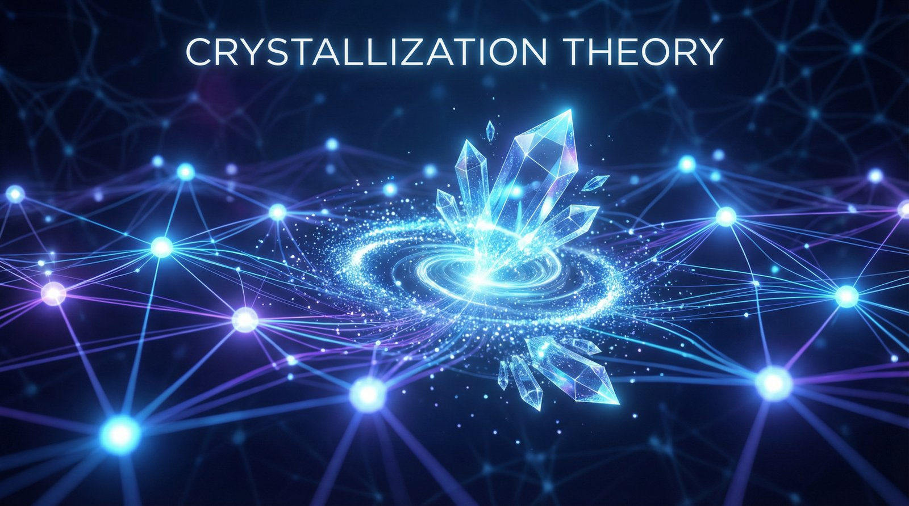
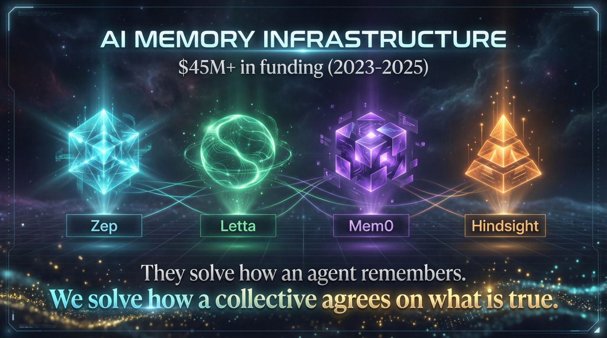
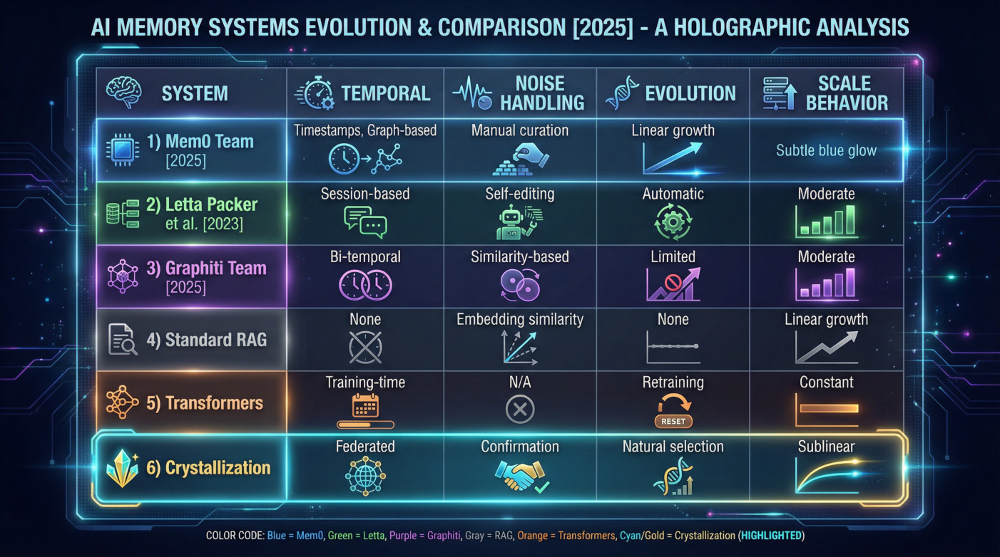
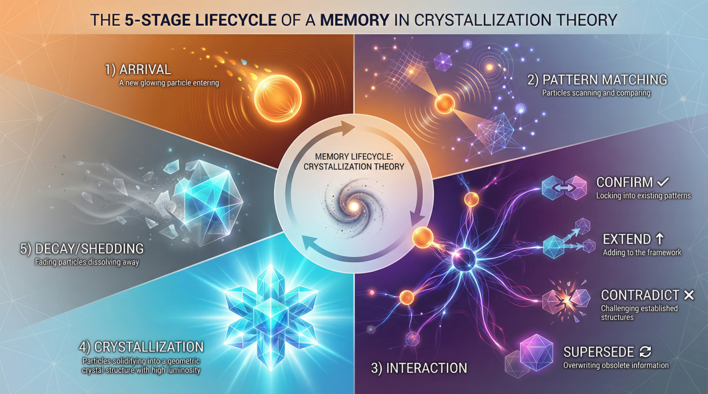
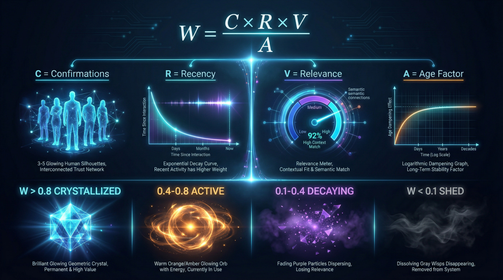
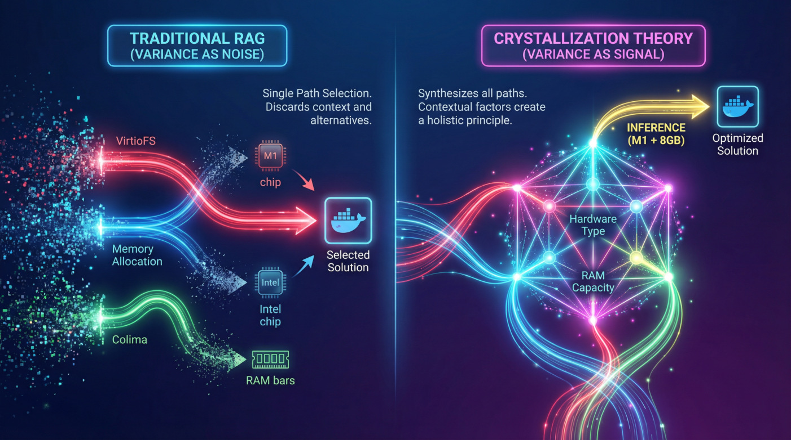
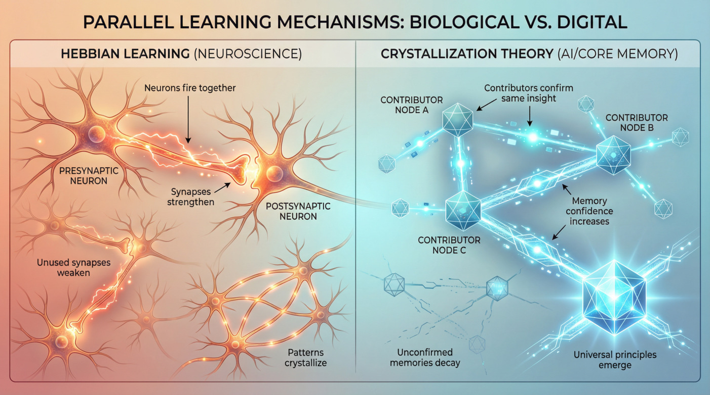
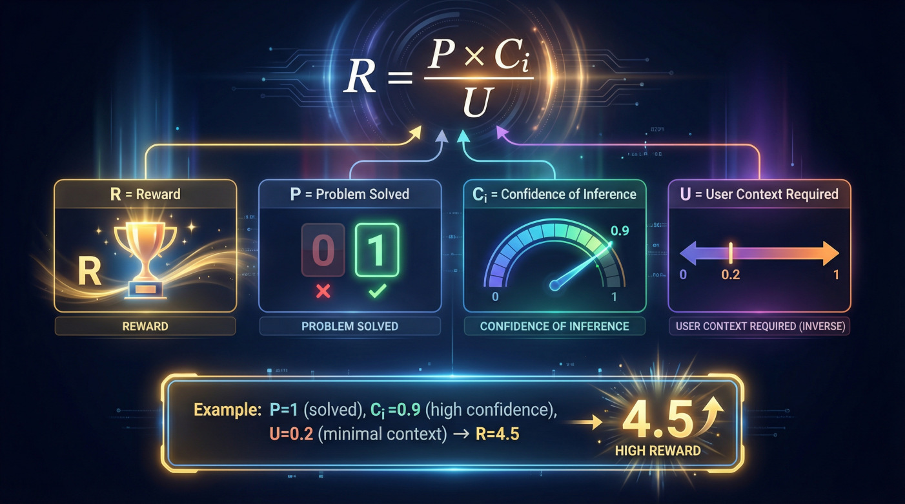
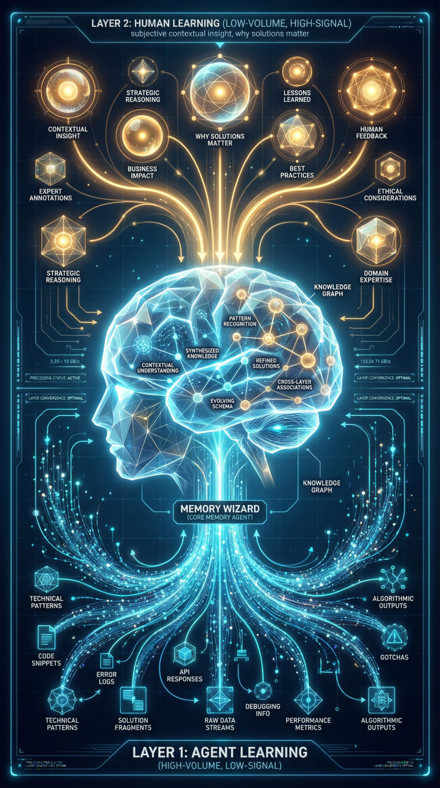

# Crystallization Theory: A Conceptual Framework for Multi-Contributor Knowledge Validation in Federated Cognitive Networks

**Richard Valentine**
Independent Researcher
Richard@RichardValentine.dev

*Figure 1: Crystallization Theory Overview*

## Abstract

Existing AI memory systems, such as Zep, Letta, and Mem0, have made significant strides in providing agents with long-term context, temporal reasoning, and self-managed memory through sophisticated centralized architectures. However, a different class of problem emerges when knowledge is distributed across multiple contributors, whether human or AI. This paper introduces Crystallization Theory, a conceptual framework that addresses the challenge of validating and synthesizing knowledge in decentralized, federated cognitive networks. We propose three interlocking components: 1) Crystallization Theory, a mechanism for knowledge to emerge and solidify through multi-contributor confirmation and decay, inspired by Hebbian learning; 2) Communal Inference Reinforcement (CIR), a training paradigm that rewards inference from sparse, shared signals rather than retrieval from dense, private context; and 3) Core Memory, a two-layer architecture that separates agent-discovered technical patterns from human-provided contextual insight.

The core insight is that variance between similar experiences, when triangulated across multiple contributors, reveals structure and leads to the emergence of universal principles. While existing research has explored federated knowledge aggregation and temporal reasoning, this paper argues that two concepts remain underexplored: 1) variance-based principle extraction, where the variance between multiple contributors' experiences is used to triangulate on universal principles, and 2) Communal Inference Reinforcement (CIR), a training paradigm that explicitly rewards inference from shared knowledge over retrieval from private context. We position Crystallization Theory as a framework that unifies these concepts and provides a validation roadmap for their empirical testing.

## 1 Introduction

The AI memory infrastructure market has matured dramatically, with over $45 million in disclosed funding flowing to startups building dedicated memory layers. The past two years have seen a paradigm shift, moving from simple retrieval-augmented generation (RAG) to sophisticated, stateful memory systems. Architectures like Zep [13], Letta (formerly MemGPT) [11], and Mem0 [9] have demonstrated impressive capabilities in temporal reasoning, self-directed memory curation, and enterprise-scale knowledge management. These systems effectively solve the problem of providing a single agent with persistent, long-term context. Recent theoretical work has also revealed fundamental limitations in transformer architectures' capacity for sequential reasoning [10], motivating exploration of alternative mechanisms.

*Figure 2: AI Memory Infrastructure Market Landscape (2023-2025)*

However, a different and equally important challenge remains largely unexplored: how do we build a shared, validated understanding of the world when knowledge is distributed across a network of independent contributors? How does a collective intelligence distinguish between signal and noise, fact and opinion, or universal principle and situational artifact?

This paper introduces Crystallization Theory, a conceptual framework for knowledge validation and synthesis in federated cognitive networks. It is not intended to replace existing centralized memory systems but to complement them by addressing the unique dynamics of multi-contributor environments. Our work is inspired by the observation that variance between similar experiences, when analyzed across a population, is not noise to be discarded but a signal that reveals underlying structure.

We propose three interlocking components:

1. **Crystallization Theory**: A process where knowledge emerges from the contributions of multiple agents. Memories are confirmed, extended, or contradicted by the experiences of others. Over time, confirmed memories crystallize into stable, high-confidence knowledge, while unconfirmed memories decay and are shed. This mechanism acts as a form of natural selection for knowledge, inspired by Hebbian learning principles [6].

2. **Communal Inference Reinforcement (CIR)**: A training paradigm that rewards agents for solving problems with minimal private context, forcing them to rely on the crystallized knowledge of the collective. This shifts the incentive from retrieval to inference, promoting a deeper understanding of the problem space.

3. **Core Memory Architecture**: A two-layer memory model that separates the objective, technical patterns discovered by AI agents from the subjective, contextual insights provided by human contributors. This acknowledges that true understanding requires both.

## 2 Related Work

The field of AI memory has evolved rapidly beyond simple retrieval-augmented generation (RAG). The current state-of-the-art is dominated by sophisticated, centralized memory systems that provide agents with long-term, stateful context. Our work builds on the insights from these systems while exploring a different, complementary dimension: federated knowledge crystallization.

### 2.1 Centralized, Single-Agent Memory Systems

**Zep and Graphiti (Temporal Knowledge Graphs):** The most recent advance in this area comes from Rasmussen et al. [13], who introduced Zep, a memory layer service featuring the Graphiti engine. Published in January 2025, this work established a new state-of-the-art, outperforming MemGPT on the Deep Memory Retrieval (DMR) benchmark (94.8% vs. 93.4%). Zep's key innovation is its temporally-aware knowledge graph, which dynamically synthesizes unstructured conversational data with structured business data, maintaining historical relationships over time.

**Letta, formerly MemGPT (Self-Managing Memory):** Originally proposed by Packer et al. in 2023 [11], the system now known as Letta pioneered the concept of an agent managing its own memory, inspired by operating system principles. Its virtual context management allows for self-editing memory blocks and 'sleep-time compute' for memory consolidation.

**Hindsight (Open-Source Breakthrough):** The most significant December 2025 advance came from Hindsight, an open-source architecture achieving a record 91.4% on the LongMemEval benchmark [14]. Its four-network separation (world, bank, opinion, observation) validates Crystallization Theory's proposition that epistemically distinct memory types require architectural separation, leading to a 79.7% improvement in temporal reasoning.

**State Space Models (Alternative Approach):** Concurrent work on State Space Models, particularly Mamba [5], addresses temporal processing through linear-time sequence modeling with significantly higher inference throughput than transformers. However, these approaches optimize temporal processing efficiency rather than addressing temporal awareness emergence from multi-contributor confirmation—a distinct problem that Crystallization Theory targets.

### 2.2 Context Engineering as a Discipline

Our work on the Core Memory architecture, conceived in November 2025, anticipated a broader industry trend that became evident in late December 2025: the formalization of 'Context Engineering' as a core discipline. Both Anthropic [1] and Google [4] released comprehensive frameworks and tools centered on the idea that managing an AI's context is as important as the intelligence of the model itself. Anthropic's playbook explicitly states, 'intelligence is not the bottleneck, context is.' This validates the premise of our Memory Wizard—a dedicated agent whose primary role is knowledge curation.

### 2.3 Federated Learning and Multi-Contributor Systems

While single-agent memory has matured, parallel advances in federated learning provide direct support for Crystallization Theory's multi-contributor approach. Google's PATE (Private Aggregation of Teacher Ensembles) provides a direct implementation of our confirmation mechanism [12]. Multiple 'teacher' models vote on predictions, and critically, 'when consensus is sufficiently strong, noise does not alter output.' This mirrors how knowledge crystallizes through multi-source confirmation.

**Runtime Learning (Google Titans):** Google's Titans architecture [3] introduced long-term memory modules that learn during inference, with parameters changing dynamically based on input. This represents a form of runtime crystallization that aligns with our framework's premise that knowledge should evolve through use, though it operates within a single-agent paradigm.

**Manifold-Constrained Aggregation (mHC):** Recent work on manifold-constrained hyper-connections [16] demonstrates mathematical principles for multi-stream aggregation that parallel Crystallization Theory's multi-contributor consensus mechanism. Both frameworks solve the fundamental problem of aggregating diverse inputs while preserving signal stability—mHC through projection onto the Birkhoff polytope, CT through confirmation-weighted consensus (see Appendix G.4 for detailed comparison).

### 2.4 Positioning of Crystallization Theory

Crystallization Theory does not compete with these systems; it asks a different question. While Zep, Letta, and Mem0 focus on how a single agent remembers, Crystallization Theory asks: How does a collective of agents agree on what is true? Our framework's novelty lies in three areas: 1) Multi-Contributor Triangulation, 2) Variance as Signal, and 3) Federated Knowledge Emergence.

*Figure 3: Comparison of Memory System Approaches*

Table 1: Comparison of memory system approaches. Crystallization Theory row represents proposed, not empirically validated, capabilities.

| System | Temporal | Noise Handling | Evolution | Scale Behavior |
|---|---|---|---|---|
| Mem0 [9] | Timestamps | Graph-based | Manual curation | Linear growth |
| Letta [11] | Session-based | Self-editing | Automatic | Moderate |
| Graphiti [13] | Bi-temporal | Similarity-based | Limited | Moderate |
| Standard RAG | None | Embedding similarity | None | Linear growth |
| Transformers | Training-time | N/A | Retraining | Constant |
| Crystal. (proposed) | Federated | Confirmation | Natural selection | Sublinear |

## 3 Crystallization Theory

Crystallization Theory proposes a mechanism for knowledge to emerge, strengthen, and become validated over time through the collective experience of multiple contributors. The theory is built on the idea that memories are not static but are living entities that compete for relevance and survival in a shared cognitive space.

### 3.1 The Lifecycle of a Memory

A memory, in this context, is a discrete piece of knowledge—a problem-solution pair, a factual statement, or an observed pattern. Each memory has a lifecycle driven by its interaction with new, incoming information from various contributors:

*Figure 4: Memory Lifecycle States and Transitions*

1. **Arrival**: A new memory is introduced by a contributor with low confidence, marked as novel.
2. **Pattern Matching**: The system checks for similar existing memories by problem structure.
3. **Interaction**: CONFIRMS (reinforces), EXTENDS (adds context), CONTRADICTS (challenges), or SUPERSEDES (replaces).
4. **Crystallization**: Frequently confirmed memories increase in weight and crystallize into stable knowledge.
5. **Decay and Shedding**: Unconfirmed or contradicted memories gradually lose weight and are shed.

### 3.2 The Shedding Mechanism: A Proposed Heuristic

To formalize the decay process, we propose a heuristic formula for calculating the weight ($W$) of a memory[^1]:

$$W = \frac{C \times R \times V}{A} \quad (1)$$

where:

- $C$ = Confirmations (unique contributors who confirmed)
- $R$ = Recency (exponential decay factor)
- $V$ = Relevance (applicability measure)
- $A$ = Age Factor (logarithmic dampening)

Based on this weight, we propose thresholds:

- $W > 0.8$ = CRYSTALLIZED
- $0.4 < W \leq 0.8$ = ACTIVE
- $0.1 < W \leq 0.4$ = DECAYING
- $W \leq 0.1$ = SHED

*Figure 5: Weight Formula and State Thresholds*

### 3.3 Parallel to Hebbian Learning

This process mirrors Hebbian learning principles [6], often summarized as 'neurons that fire together, wire together.' Recent theoretical work has established that transformer architectures belong to the TC0 circuit complexity class, meaning they cannot simulate even simple finite automata and thus have fundamental limitations in sequential and temporal reasoning [10]. This computational limitation motivates our search for alternative mechanisms.

Recent work on biologically-inspired architectures, such as the Dragon Hatchling (BDH) model [7], has demonstrated that Hebbian synaptic plasticity can match GPT-2 performance at equivalent parameter counts (10M-1B parameters) while learning faster per data token. The BDH architecture uses local edge-reweighting where synapses update based purely on the states of connected neurons—strengthening when they co-activate and weakening otherwise. Notably, BDH achieves monosemantic representations, where individual synapses correspond to specific concepts, even below 100M parameters—a property transformers struggle to exhibit.

Table 2: Hebbian learning parallel in Crystallization Theory

| Neuroscience | Core Memory |
|---|---|
| Neurons fire together | Contributors confirm same insight |
| Synapses strengthen | Memory confidence increases |
| Unused synapses weaken | Unconfirmed memories decay |
| Patterns crystallize | Universal principles emerge |

*Figure 6: Hebbian Learning Parallel in Crystallization Theory*

*Figure 7: Variance as Signal—Extracting Universal Principles*

### 3.4 Variance as Signal: A Concrete Example

To illustrate the core mechanism of Crystallization Theory, consider a scenario where three developers independently encounter the same problem: slow Docker container performance on macOS. Each arrives at a different solution: Developer A (M1 processor, 16GB RAM) resolves the issue by enabling VirtioFS in Docker Desktop; Developer B (Intel processor, 32GB RAM) succeeds by increasing Docker's memory allocation; Developer C (M2 processor, 8GB RAM) switches to an alternative container runtime (colima).

A traditional RAG system treats this variance as noise. It retrieves the most semantically similar solution—typically the most recent or highest-ranked—and discards the others. The user receives a single recommendation that may or may not apply to their specific hardware configuration. Critically, the system loses four categories of information: (1) the existence of multiple valid solutions, (2) the correlation between hardware architecture and solution effectiveness, (3) the role of RAM as a constraining factor, and (4) the meta-knowledge that this represents a class of context-dependent problems.

Crystallization Theory takes a different approach. By analyzing what is common across all three experiences (macOS, Docker, performance degradation) and what varies (processor architecture, RAM capacity, solution type), the system triangulates a universal principle: Docker performance on macOS is bottlenecked by the virtualization layer, and optimal solutions depend on hardware constraints rather than the symptom alone. This principle, along with the contextual factors that determine which solution applies, becomes crystallized knowledge with weight proportional to confirmations (per Equation 1).

The network effect becomes evident when a fourth developer arrives with a novel context: M1 processor with only 8GB RAM. Rather than returning Developer A's VirtioFS solution (which may fail due to insufficient RAM), the crystallized knowledge enables inference: the M1 architecture suggests VirtioFS compatibility, but the 8GB constraint aligns with Developer C's colima solution. If Developer D confirms that colima succeeds in this context, the system records a new confirmation, increasing the weight of colima for Apple Silicon configurations with limited RAM. Over time, the solution space becomes increasingly well-mapped, with high-confidence recommendations for common contexts and explicit uncertainty markers for edge cases. This exemplifies the Hebbian dynamic from Figure 6: solutions that are repeatedly confirmed together (architecture + RAM + approach) strengthen their connections, while unconfirmed combinations decay.

## 4 Communal Inference Reinforcement

*Figure 8: CIR Reward Formula and Context Burden Problem*

Communal Inference Reinforcement (CIR) is a proposed training paradigm designed to leverage the crystallized knowledge of the collective. It addresses what we call the 'Context Burden Problem'—the need for a user to provide extensive context and background for an AI to be helpful.

Traditional RAG systems are rewarded for finding the best matching answer in their corpus. CIR, in contrast, rewards an agent for solving a problem with the minimal amount of user-provided context. This forces the agent to rely on the shared, crystallized knowledge of the network.

We propose a CIR reward formula:

$$R = \frac{P \times C_i}{U} \quad (2)$$

where:

- $R$ = Reward
- $P$ = Problem Solved (binary: 0 or 1)
- $C_i$ = Confidence of Inference (continuous: 0 to 1)
- $U$ = User Context Required (normalized from 0 to 1)

An agent that solves a problem with high confidence ($P=1$, $C_i = 0.9$) using minimal user context ($U = 0.2$) would receive a high reward ($R = 4.5$). This paradigm incentivizes a shift from simple answer retrieval to genuine topology navigation within the problem space.

## 5 Core Memory Architecture

*Figure 9: Core Memory Architecture—Two-Layer Learning Model*

To implement this theory, we propose the Core Memory architecture, which features a dedicated 'Memory Wizard' agent and a two-layer learning model.

**Two-Layer Learning.** Knowledge is captured in two distinct layers:

- **Layer 1 (Agent Learning)**: Captures objective, technical patterns, solutions, and gotchas—high-volume and technical.
- **Layer 2 (Human Learning)**: Provides subjective, contextual insight explaining why a solution matters—lower-volume but higher signal value.

This two-layer approach bridges the gap between tacit knowledge (the 'why') and explicit knowledge (the 'what').

### 5.1 Network Effects and Cross-Pollination

The power of this architecture lies in its network effects. As more contributors add their experiences, the knowledge graph densifies. Cross-domain connections emerge, leading to 'cross-pollination'—emergent insights that no single contributor possessed individually. For example, a DevOps engineer and a real-time audio engineer might contribute seemingly unrelated memories about GPU scheduling and latency. The graph, by connecting these, could crystallize a new principle: 'For real-time audio AI, Kubernetes pod affinity to specific GPU nodes is critical for meeting latency requirements.'

## 6 Technical Specification

The complete technical specification spans six appendices, each addressing a distinct aspect of implementation. Table 3 summarizes the appendix contents and their primary contributions to the framework.

Table 3: Technical Specification Summary

| Appendix | Content | Key Contribution |
|---|---|---|
| A | Mathematical Formalization | Weight formula proofs, convergence theorems, asymptotic guarantees |
| B | Algorithmic Specification | 4 algorithms with pseudocode, complexity analysis, edge case handling |
| D | Security & Privacy | Byzantine threat model, differential privacy, secure aggregation |
| E | Scalability Analysis | $O(1)$ validation complexity w.r.t. $N$, performance benchmarks |
| F | Implementation Architecture | Federated node topology, consensus protocol, deployment configurations |
| G | Federated Learning Comparison | PATE, FKGE, FedRAG, mHC comparisons with framework selection guide |

The core data structure, `CrystallizedMemory`, tracks three layers: (1) a **Temporal Layer** for creation/modification timestamps that feed Recency ($R$) and Age ($A$) calculations, (2) a **Crystallization Layer** managing confirmations, weight, and state transitions, and (3) a **Triangulation Layer** capturing variance between contributors' experiences. Algorithm 2 (Appendix B) implements the weight formula from Equation 1, while Algorithm 4 implements the CIR training loop from Equation 2.

## 7 Discussion

### 7.1 Implications for AI System Design

Crystallization Theory suggests that memory is not just infrastructure; it is a cognitive function. This implies a move away from monolithic agent architectures towards systems with dedicated memory agents—a 'Memory Wizard' or 'Librarian'—whose sole responsibility is knowledge curation. This separation of concerns improves both the quality of knowledge and the efficiency of task-oriented agents.

### 7.2 Limitations

This framework has several limitations:

- **Cold Start**: Triangulation requires 3-5+ contributors
- **Domain Specificity**: Best suited for repeatable patterns
- **Privacy Considerations**: Federated learning introduces challenges like gradient leakage
- **Confirmation Bias Risk**: The system could potentially over-crystallize popular but incorrect information if early contributors converge on a flawed solution. Robust mechanisms for contradiction handling, minority report preservation, and external validation would be essential to mitigate this risk.

### 7.3 Empirical Validation Roadmap

This paper presents a conceptual framework. The next critical step is empirical validation. We propose a three-phase roadmap:

- **Phase 1**: Prototype Implementation
- **Phase 2**: Controlled Experiment using Stack Overflow questions
- **Phase 3**: Benchmark Comparison against LoCoMo [8], LongMemEval [14], and TRAM [15]

Two primary metrics will determine success: Retrieval Accuracy and Context Efficiency (using the CIR reward formula from Equation 2).

## 8 Conclusion

Crystallization Theory offers a new perspective on AI memory, shifting the focus from single-agent context to multi-contributor knowledge validation. By treating variance as a signal and leveraging federated learning principles, we can build systems that not only remember but also understand. The framework presented here is a starting point, a set of falsifiable hypotheses that we hope will inspire further research into the exciting field of collective AI cognition.

## Declarations

### AI Assistance Disclosure

In accordance with emerging standards for AI transparency in academic publishing [2], we provide disclosure of AI involvement in this work. AI tools (Claude, Anthropic) were used for literature synthesis, structural editing, and iterative refinement of explanations. The conceptual framework, all theoretical claims, and final editorial decisions are the responsibility of the human author. No AI-generated content was included without human review and approval.

### Patent Notice

**Patent Pending.** The methods and systems described in this paper, including but not limited to: (1) the multi-contributor knowledge validation method using the crystallization weight formula $W = (C \times R \times V)/A$ with threshold-based lifecycle state transitions; (2) the variance-as-signal triangulation mechanism for meta-knowledge extraction; (3) the two-layer Core Memory architecture; and (4) the Communal Inference Reinforcement training paradigm, are the subject of U.S. Provisional Patent Application No. 63/953,509, filed January 3, 2026, by Richard Valentine. Commercial implementations of these methods require appropriate licensing. Academic and research use is encouraged.

## References

1. Anthropic (2024) Model context protocol specification

2. COPE Council (2025) COPE guidelines for AI in academic publishing

3. Google DeepMind (2025) Titans: Learning to memorize at test time. arXiv preprint arXiv:250100663

4. Google Research (2025) Google research 2025: Bolder breakthroughs, bigger impact

5. Gu A, Dao T (2024) Mamba: Linear-time sequence modeling with selective state spaces. arXiv preprint arXiv:231200752

6. Hebb DO (1949) The organization of behavior: A neuropsychological theory. Wiley & Sons, New York

7. Kosowski A, Uznański P, Chorowski J, Stamirowska Z, Bartoszkiewicz M (2025) The dragon hatchling: The missing link between the transformer and models of the brain. arXiv preprint arXiv:250926507

8. Maharana A, Lee D-H, Tuber S, Bansal M (2024) Evaluating very long-term conversational memory of LLM agents. In: Proceedings of ACL 2024

9. Mem0 Team (2025) Mem0: The memory layer for AI

10. Merrill W, Sabharwal A (2023) The parallelism tradeoff: Limitations of log-precision transformers. Transactions of the Association for Computational Linguistics (TACL)

11. Packer C, Fang V, Patil SG, Lin K, Wooders S, Gonzalez JE (2023) MemGPT: Towards LLMs as operating systems. arXiv preprint arXiv:231008560

12. Papernot N, Abadi M, Erlingsson Ú, Goodfellow I, Talwar K (2018) Scalable private learning with PATE. arXiv preprint arXiv:180208908

13. Rasmussen P, Paliychuk P, Beauvais T, Ryan J, Chalef D (2025) Zep: A temporal knowledge graph architecture for agent memory. arXiv preprint arXiv:250113956

14. Vectorize.io (2025) Hindsight: An open-source memory architecture for AI agents

15. Wang J, Cheng J, Wu H, Liu H, Yang D (2024) TRAM: Benchmarking temporal reasoning for large language models. In: Proceedings of ACL 2024

16. Xie Z, Wei Y, Cao H, Zhao C, Deng C, Li J, others, Liang W (2025) mHC: Manifold-constrained hyper-connections. arXiv preprint arXiv:251224880

---

> **Note — Appendices omitted.** The full paper (v2.1, 60 pages) includes six mathematical appendices (A: Mathematical Formalization, B: Crystallization Weight Function derivation, C: Scoring & Convergence, D: Communal Inference Reinforcement formalization, E: Worked Examples, F: Empirical Validation). This markdown contains the main body through the References section — the appendices live only in the [Zenodo PDF](https://zenodo.org/records/19350176).
